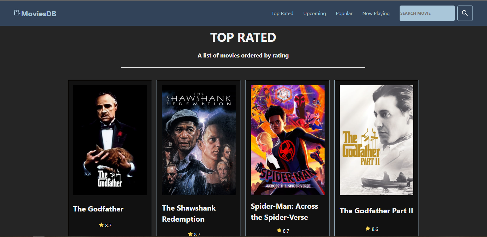
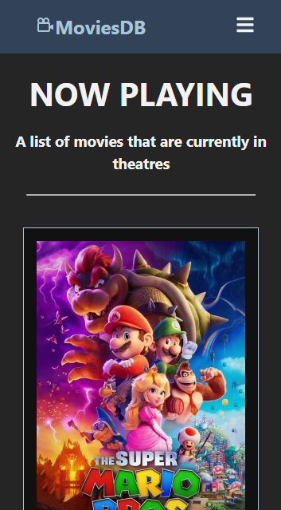

# tmdb
### React-Vite App created to practice react hooks consuming TMDB's API

    This is a experimental project where i use React hooks to consume TMDB's API 
    and feed the app pages. The main objetive is to pratice the usage of useState and 
    useEffect hook, creating a fully functional application.

    The main part of the app was made following <a href="https://youtu.be/XqxUHVVO7-U" target="_blank" rel="external">this</a> tutorial from Matheus Battisti of "Hora de Codar" 
    channel on Youtube, you can find the original repository <a href="https://github.com/matheusbattisti/movies_lib" target="_blank" rel="external">here</a>.

# App Screenshots
### Here is the app screen on desktops

### An here is the screen of th app on mobile devices

